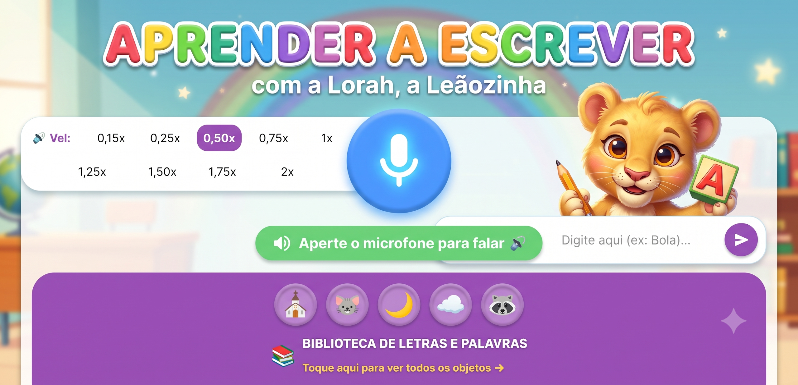
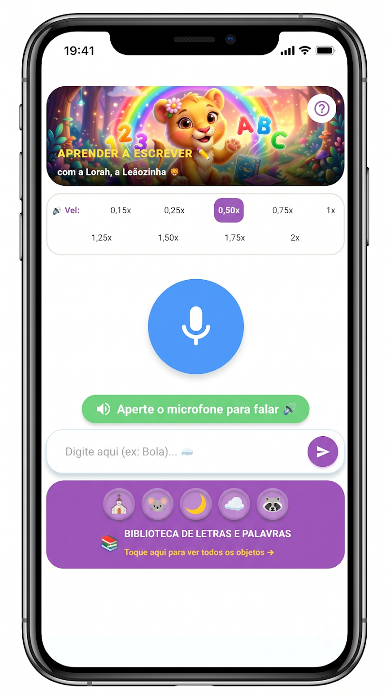
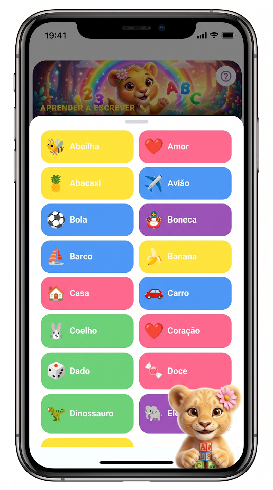
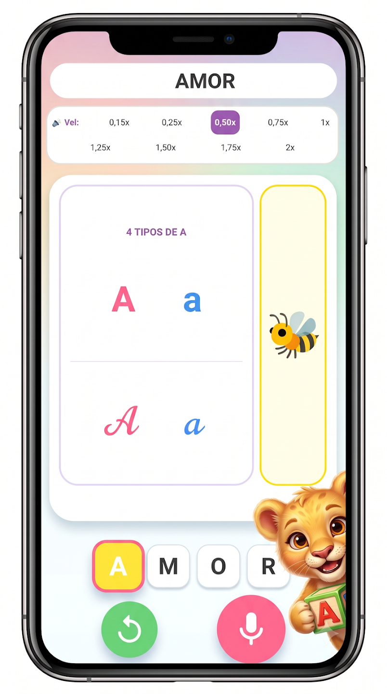

# ✏️ Como Escrevo?

  

## 🦁 Conheça a Lorah

  

  <strong>Esta é a Lorah!</strong> 
  A companheira das crianças na aventura de aprender a ler, escrever e soletrar.

  

---

## 📚 Sobre o Como Escrevo?

O **Como Escrevo?** é um aplicativo educativo criado para tornar a descoberta das palavras, letras, sons e números mais divertida e interativa.

Com a ajuda da **Lorah**, a criança pode explorar o universo das palavras de uma maneira simples, intuitiva e envolvente.

A proposta é transformar uma pergunta muito comum durante a alfabetização:

> **"Como escreve?"**

em uma oportunidade para **descobrir, ouvir, soletrar e aprender.**

---

## 📱 Conheça o aplicativo

  
  
  

  <em>Uma experiência pensada para tornar o aprendizado mais divertido e interativo.</em>

---

## ✨ O que a criança pode explorar?

### 🎙️ Interação por voz

A criança pode falar com o aplicativo e explorar palavras utilizando a voz.

### 🔤 Palavras e soletração

Explore as letras que formam as palavras e acompanhe sua soletração.

### 🔊 Pronúncia

Ouça as palavras e seus sons durante a experiência.

### 🔢 Números

Explore também números e suas formas escritas.

### 🎯 Desafios progressivos

Uma experiência que acompanha diferentes momentos da jornada de aprendizagem.

---

## 👨‍👩‍👧 Pensado para crianças e famílias

O **Como Escrevo?** foi desenvolvido pensando em uma experiência simples e intuitiva para as crianças.

A **Área dos Pais** também oferece recursos e configurações destinados aos adultos responsáveis.

---

## 🎨 Aprender brincando

Mais do que apresentar letras e palavras, o objetivo do **Como Escrevo?** é criar uma experiência na qual a criança tenha curiosidade para perguntar, ouvir, descobrir e tentar novamente.

Porque aprender também pode ser divertido. 💛

---

## 📲 Baixe gratuitamente

O **Como Escrevo?** está disponível para dispositivos Android através da Google Play.

  

  <strong>🦁 Venha conhecer a Lorah e descobrir o mundo das palavras!</strong>

---

## 🔒 Privacidade

A privacidade e a segurança das crianças são aspectos importantes no desenvolvimento do aplicativo.

Para conhecer os detalhes sobre coleta, utilização e proteção de dados, consulte a **Política de Privacidade** disponibilizada para o aplicativo.

---

## 📬 Contato

Para dúvidas, sugestões ou informações sobre o aplicativo:

**E-mail:** `contato@devemcasa.com.br

---

  <strong>✏️ Como Escrevo?</strong> 
  <em>Aprender brincando!</em>

 

  Desenvolvido por

  <a href="https://devemcasa.com.br/">
    <strong>🏠 DEV EM CASA</strong>
  </a>

  <em>Ideias que viram soluções digitais.</em>

  © 2026 Como Escrevo? — Todos os direitos reservados.

